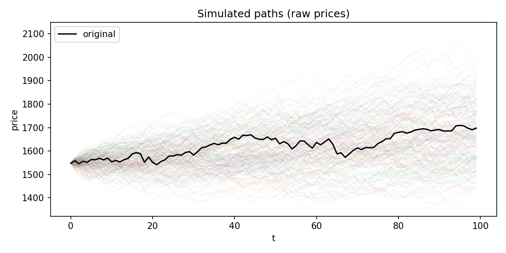

# Synthetic Path Maker

> From **price-driven weights** to **synthetic market paths**

[](https://www.python.org/)
[](#)
[](#license)

**Synthetic Path Maker** is a lightweight generator of synthetic financial time series.

Given a historical price series \(P_t\), it:

1. computes a smoothed derivative of \(\log P_t\),
2. builds **directional weights** on time indices,
3. normalises them into a discrete sampling distribution \(p_i\),
4. and propagates historical returns along sampled indices to obtain **synthetic price paths**.

The implementation follows the methodology of the working paper  
“*Distribution Maker: From Price-Driven Weights to Synthetic Market Paths*” (2025),  
with a few engineering refinements for real-world CSV data.

```text
CSV (OHLCV) ──▶ log-price derivative ──▶ directional weights ──▶ index sampling ──▶ synthetic path
```

---

## Table of Contents

- [Features](#features)
- [Installation](#installation)
- [Quick Start](#quick-start)
- [CLI Reference](#cli-reference)
- [Repository Structure](#repository-structure)
- [Methodology (Short)](#methodology-short)
- [Implementation Notes vs. Paper](#implementation-notes-vs-paper)
- [Seeds Validation](#Seeds-validation)
- [Roadmap](#roadmap)
- [License & Citation](#license--citation)

---

## Features

- **Directional weighting of market regimes**  
  Smoothed derivative of \(\log P_t\) is split into up/down components and converted into weights
  using \((lpha, eta, \gamma)\), giving explicit control over bullish vs. bearish emphasis.

- **Robust equispaced CDF + inverse**  
  `EquispacedPiecewiseConstantCDF` represents a piecewise-constant density on an equispaced grid
  and exposes a numerically stable CDF and inverse CDF (with correct handling of zero-mass plateaux).

- **Synthetic path generator**  
  `build_synthetic_path` builds synthetic sequences by re-using historical returns under the designed
  index distribution, starting from a real observed point.

- **CSV-ready CLI**  
  `main.py` takes standard OHLCV-style CSV files, detects date and price columns, enforces positivity
  for log-transforms, and saves both plots and synthetic paths to disk.

- **Modular design**  
  The code is split into small, self-contained modules: weighting, CDF/inverse, sampling, path
  construction, plotting, and I/O.

---

## Installation

Clone the repository and install the minimal dependencies:

```bash
git clone https://github.com/<your-user>/synthetic-path-maker.git
cd synthetic-path-maker

pip install numpy pandas matplotlib
# optional but recommended: Savitzky–Golay smoothing
pip install scipy
```

---

## Quick Start

Assume you have a CSV `data/AAPL.csv` with at least a `Date` column and a `Close` column.

Run:

```bash
python main.py   --csv data/AAPL.csv   --price-col Close   --seed 112
```

This will:

1. create a new run directory under `plot/` (e.g. `plot/plot1/`),
2. load and clean the price series,
3. compute directional weights and discrete probabilities \(p_i\),
4. instantiate the equispaced CDF (for diagnostics),
5. generate a synthetic price path of length \(N\) (same as input),
6. save:
   - `01_cdf.png` – empirical CDF plot of the discrete distribution,
   - `02_price_initial.png` – original price series,
   - `price_synthetic.png` – original vs synthetic price,
   - `synth_path.csv` – synthetic price series.

To pick a random CSV from a directory:

```bash
python main.py   --csv-dir data/   --seed 112
```

> For all available options, run:
>
> ```bash
> python main.py --help
> ```

---

## CLI Reference

`main.py` exposes the following arguments (via `argparse`):

```text
--csv        Path to a single CSV file (overrides --csv-dir).
--csv-dir    Directory containing CSV files; one will be chosen at random.

--date-col   Date column name (e.g. Date, Datetime).
             If omitted, common names are auto-detected.

--price-col  Price column name (e.g. Close, Adj Close, Price).
             If omitted, a small set of candidates is tried.

--seed       Random seed (used for CSV choice and path generation).

--window     Savitzky–Golay window size.
--polyorder  Savitzky–Golay polynomial order.

--gamma      Exponent in the weight formula (≥ 1).
--alpha      Weight for upward slopes (bullish intensity).
--beta       Weight for downward slopes (bearish intensity).
--rho        Triangular smoothing parameter for weights (0 ≤ ρ ≤ 1).
```

Minimal working example:

```bash
python main.py   --csv data/example.csv   --seed 123   --window 31   --polyorder 3   --gamma 1.5   --alpha 2.0   --beta 0.2   --rho 0.1
```

---

## Repository Structure

```text
.
├── main.py                 # CLI entry point and end-to-end workflow
├── weights.py              # smoothed log-price derivative + directional weights
├── CDF_and_inverse.py      # equispaced piecewise-constant CDF + inverse CDF
├── append_tuples.py        # synthetic path construction + original vs synthetic plots
├── sampling.py             # generic index sampling (multinomial) [optional utility]
├── one_to_one.py           # monotone 1–to–1 matching between nodes and samples
└── plot/                   # auto-created run directories: plot1/, plot2/, ...
```

Module roles:

- [`weights.py`](./weights.py)  
  Implements `compute_weights_precise(y, f, ...)`, which returns:
  - `s`: non-negative weights on nodes \(y_i\),
  - `p`: discrete probabilities \(p_i = s_i / \sum_j s_j\),
  plus auxiliary diagnostic arrays.

- [`CDF_and_inverse.py`](./CDF_and_inverse.py)  
  Implements `EquispacedPiecewiseConstantCDF(y, s)`, which exposes:
  - `.cdf(x)` – CDF at scalar or array `x`,
  - `.finv(u)` – inverse CDF for `u ∈ (0,1)`,
  - `.sample_stratified(N, seed)` – optional stratified sampling.

- [`append_tuples.py`](./append_tuples.py)  
  Implements:
  - `build_synthetic_path(payload, p, n_periodi, start_index=None, use_price_only=True, seed=None)`,
  - `save_plots_orig_vs_synth(payload, synth, outdir, title)`.

- [`sampling.py`](./sampling.py)  
  Implements `sample_indices_with_replacement(s, M, seed=None)` for direct multinomial sampling
  given non-normalised weights `s`. Not used by `main.py`, but available if you want to experiment.

- [`one_to_one.py`](./one_to_one.py)  
  Implements `match_samples_to_nodes(y, X)` for monotone 1–to–1 pairing between grid nodes and
  sampled locations.

---

## Methodology (Short)

### 1. Directional weights on an equispaced grid

Given a price series \(P_t\), `main.py` constructs:

- an equispaced index grid \(y_i\), \(i = 0, \dots, N-1\),
- the log-price series \(f_i = \log P_i\).

`compute_weights_precise(y, f, ...)` proceeds as follows:

1. **Smoothed derivative**  

   A derivative \(d_i pprox rac{df}{dy}(y_i)\) is obtained by:

   - applying a Savitzky–Golay filter with window `window` and polynomial order `polyorder`
     (or a moving-average + finite-difference fallback), enforcing:
       - odd window,
       - window > `polyorder`,
       - window ≤ \(N-1\).

2. **Directional decomposition**  

   Upward and downward components:

   \[
   u_i = \max(d_i, 0), \qquad v_i = \max(-d_i, 0).
   \]

3. **Raw weights**  

   For each index \(i\):

   \[
   s_i = lpha\,u_i^\gamma + eta\,v_i^\gamma + arepsilon, \quad \gamma \ge 1,\ lpha,eta > 0,
   \]

   with a small \(arepsilon\) to avoid the all-zero case.

4. **Triangular smoothing**  

   A light local smoothing with parameter \(
ho \in [0,1]\) blends each weight with its neighbours.

5. **Normalisation**  

   The discrete probabilities used by the generator are:

   \[
   p_i = rac{s_i}{\sum_j s_j}.
   \]

### 2. Equispaced CDF and inverse

`EquispacedPiecewiseConstantCDF(y, s)` interprets:

- `y` as an equispaced grid \(y_i\),
- `s` as non-negative cell weights.

It defines a piecewise-constant density on cells:

\[
[y_i - 	frac{1}{2}\Delta y,\ y_i + 	frac{1}{2}\Delta y),
\]

and exposes a numerically stable CDF and inverse CDF, including correct behaviour on flat regions
(where multiple consecutive weights are zero).

In the current CLI, this object is instantiated for diagnostics and potential advanced use; the main
synthetic path generator uses the discrete probabilities \(p_i\) directly.

### 3. Synthetic path construction

`build_synthetic_path` in `append_tuples.py` implements the generator used by `main.py`:

1. Compute price returns:

   \[
   r^{(P)}_t = rac{P_t - P_{t-1}}{\max(P_{t-1}, 10^{-12})}, \quad t \ge 1.
   \]

2. Form a “valid” probability vector \(p^{	ext{valid}}\) with zero mass at index 0
   (so only indices \(i \ge 1\) are used for returns); if this collapses, fall back to uniform on
   \(\{1, \dots, N-1\}\).

3. Choose starting values:

   - if `start_index is None`, start from the last observed values of each feature,
   - otherwise from row `start_index`.

4. Iterate for \(t = 1, \dots, T-1\):

   - draw an index \(i_t \sim p^{	ext{valid}}\),
   - set price return \(r_t = r^{(P)}_{i_t}\),
   - if `use_price_only=True` (default in `main.py`), apply \(r_t\) to all features;
   - otherwise, for each feature, compute its own return at index \(i_t\) and apply it.

The result is a synthetic path that reuses historical returns according to the designed index
distribution \(p_i\), starting from a real market state.

---

## Implementation Notes vs. Paper

Compared to the paper-level description, this implementation includes several practical adjustments:

- **CSV robustness**  
  `load_series_from_csv`:
  - parses and sorts by a detected date column,
  - detects a price column heuristically,
  - removes non-finite prices,
  - shifts the series slightly upward if any values are ≤ 0 (to make `log` well-defined).

- **Window selection**  
  `make_valid_savgol_window` clamps and adjusts the requested Savitzky–Golay window so that:
  - it is odd,
  - strictly greater than `polyorder`,
  - and ≤ \(N-1\).

- **Path generator choice**  
  The CLI currently uses:
  - discrete sampling from \(p_i\) (no continuous sampling from the CDF),
  - `use_price_only=True`,
  - synthetic length \(T = N\) (same length as the input series).

- **Advanced utilities exposed but not wired**  
  `sampling.py` and `one_to_one.py` are provided as utilities for experimentation
  (e.g., multinomial counts, monotone pairing of samples to nodes) but are not used by `main.py`.

These design choices keep the code path simple, deterministic and easy to audit, while still exposing
the components needed for more sophisticated experiments.

---

### Seeds validation

### Validation and diagnostics

The repository includes a small **validation pipeline** to check how the generator behaves across random seeds and how the synthetic series compare to the original data.

For a fixed CSV and fixed hyperparameters, we generate many synthetic paths by varying only the pseudo-random seed. All paths start from the same historical point, so they are directly comparable. The script `validate_seeds.py` then produces:

- **Path ensemble plot** (`<prefix>_paths.png`): the original series (black) overlaid with all simulated trajectories (coloured), to visually inspect the spread and shape of the synthetic paths.
- **Time-wise statistics** (`<prefix>_moments.csv`): empirical mean and standard deviation of the shifted process \(X_t = P_t - P_0\) across runs, together with the fraction of synthetic paths above the original and the z-score of the original path relative to the ensemble.
- **Terminal distribution** (`<prefix>_final_samples.csv`): samples of the terminal shifted value \(X_T\), with summary statistics (mean and standard deviation) reported in the console.
- **Per-path dispersion** (`<prefix>_per_path_metrics.csv`): for each synthetic path, the terminal shifted value \(X_T\) and its realised volatility over the horizon.
- **Return-level comparison** (`<prefix>_return_stats.csv`): side-by-side moments and quantiles of one-step returns for the original series and for all synthetic paths pooled together (mean, standard deviation, skewness, kurtosis, and the 1%, 5%, 50%, 95%, 99% quantiles).

These diagnostics allow a direct quantitative comparison between the empirical distribution of historical returns and the distribution induced by the generator, as well as a visual check of the variability of synthetic price paths under different seeds.




## Roadmap

Potential extensions that fit naturally into the current design:

- **Multi-feature evolution**  
  Activate `use_price_only=False` in `main.py` and extend `payload` to include other features
  (e.g. volume, indicators), each with its own returns.

- **Alternative sampling schemes**  
  Replace discrete sampling with:
  - continuous sampling from `EquispacedPiecewiseConstantCDF`,
  - stratified sampling,
  - or 1–to–1 matching via `match_samples_to_nodes`.

- **Diagnostics and evaluation**  
  Add notebooks comparing original vs synthetic series in terms of:
  - return distributions,
  - autocorrelations,
  - volatility clustering,
  - regime duration statistics.

---


## License & Citation

> *Distribution Maker: From Price-Driven Weights to Synthetic Market Paths* (2025).  
> Agostino Gallo, working paper.

